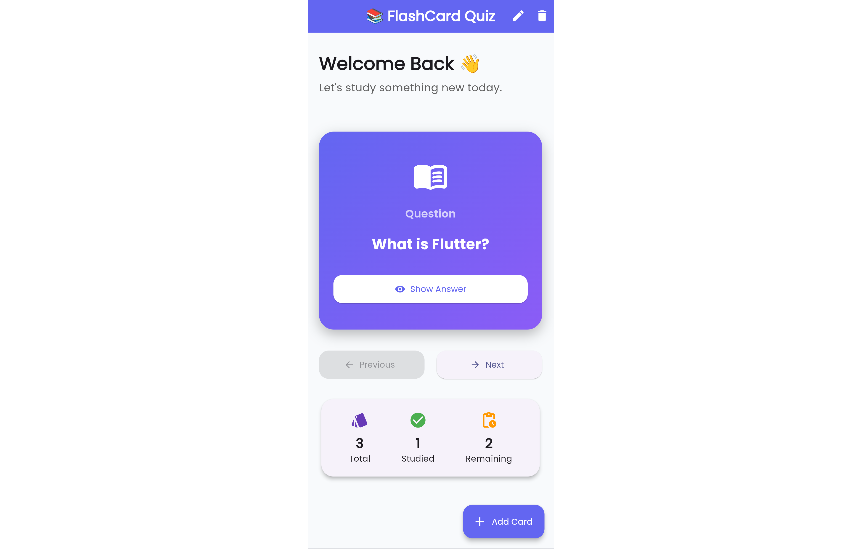
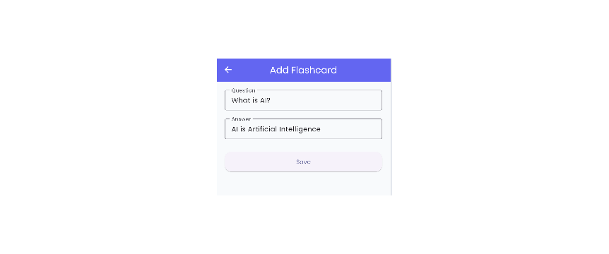
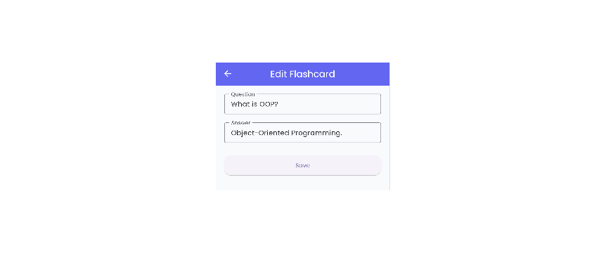

# 📚 FlashCard Quiz App

A modern FlashCard Quiz App developed using Flutter.

## ✨ Features

- 📖 Question & Answer Flashcards
- 👁️ Show/Hide Answer
- ➕ Add Flashcards
- ✏️ Edit Flashcards
- 🗑️ Delete Flashcards
- ⬅️ Previous / Next Navigation
- 📊 Study Statistics
- 🎨 Modern Material 3 UI
- 🌈 Beautiful Gradient Design
- 💾 Local Data Storage
- 📱 Responsive Mobile Design

## 🛠️ Technologies Used

- Flutter
- Dart
- Material 3
- Shared Preferences
- Google Fonts
- Flutter Animate

## Screenshots

### Home Screen

### Question Card

### Answer Card

### Add Flashcard

### Edit Flashcard

### Statistics

## Developer

Abdul Moiz